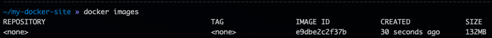
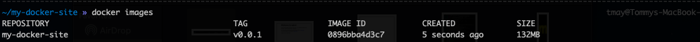
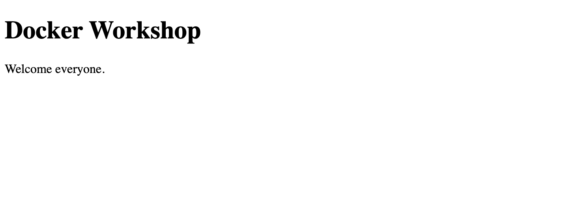
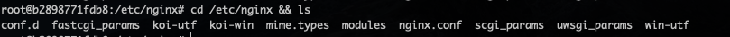
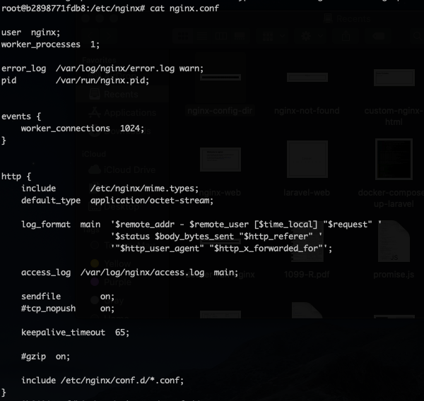
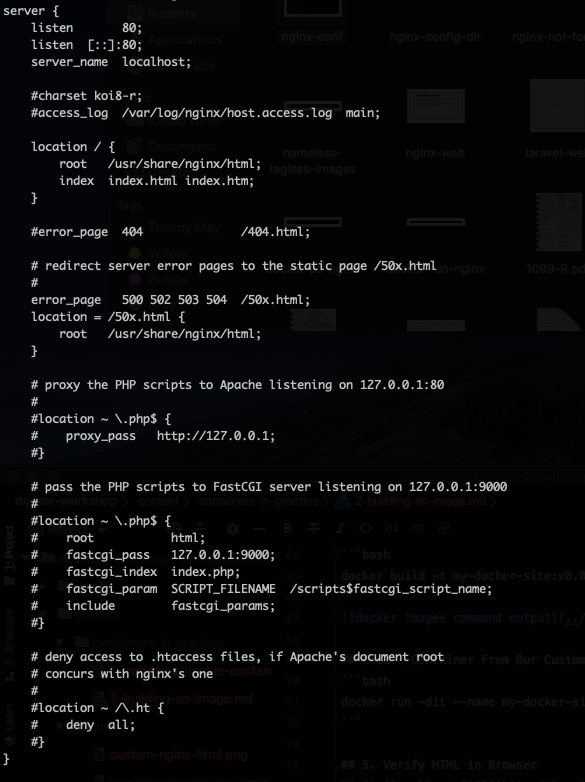

# Goals
We are going to walk through building an image from a basic Dockerfile and extending that Dockerfile more and more
to achieve the results we want. On this page we will:

* Extend another docker image
* Modify the configuration of the base docker image
* Learn how to publish our docker image to a registry.

# Extend Another Docker Image
Let's say we want to serve our own HTML instead of the Nginx welcome page. After all if the only thing we could do with
containers is serve welcome pages then they would not be all that useful.

## 1. Create a Test Directory
```bash
mkdir -p ~/my-docker-site/html && cd ~/my-docker-site
```

## 2. Add Our Own HTML
Copy this HTML to a file at `~/my-docker-site/html/index.html`
```html
<!DOCTYPE html>
<html>
<head>
<title>Docker Workshop</title>
</head>
<body>

<h1>Docker Workshop</h1>
<p>Welcome everyone.</p>

</body>
</html>
```

## 3. Create a Dockerfile
Place this file as `~/my-docker-site/Dockerfile`
```dockerfile
FROM nginx:1.18.0
COPY html /usr/share/nginx/html
```

## 4. Build the Docker Image
From the `~/my-docker-site` directory
```bash
docker build .
```

If you notice when we now run the command to list available images we will have a nameless/tagless image
```bash
docker images
```


This is not ideal to have a namelss/tagless image, as referencing images by their ID makes for less readable commands.
Let us try to rebuild the docker image but this time provide a name and tag.

From the `~/my-docker-site` directory
```bash
docker build -t my-docker-site:v0.0.1 .
```


## 5. Create Container From Our Custom Image
```bash
docker run -dit --name my-docker-site -p 8080:80 my-docker-site:v0.0.1
```

## 6. Verify HTML in Browser
Visit [localhost:8080](http://localhost:8080) to see our HTML instead of the default Nginx welcome page.


# Modify the configuration of the base docker image
Now we have our own Docker image what if we wanted to take our Nginx server a bit further and add some custom redirects
to it. For the sake of this example let's say we want to redirect `/homepage` to `/` because we moved where our homepages lives.

Picking up where we left off, if you visit [localhost:8080/homepage](http://localhost:8080/homepage) then you will see the
standard Nginx "not found" page.


Let's get this route to redirect to `/` where we have placed our custom HTML page. This process will take a little
Nginx knowledge, but let's walk through the steps together.

## 1. Find the Nginx Config
With our `my-docker-site` container running let's get inside of the container, so we can poke around the existing configuration.
```bash
docker exec -it my-docker-site bash
```
The above command should open up the prompt to use the container as our shell.

Let's navigate to the standard spot we would normally find Nginx configuration
```bash
cd /etc/nginx && ls
```

You can see from the above output we have the standard `nginx.conf` file so let us see what is inside of it
```bash
cat nginx.conf
```


## 2. Modify the Config to Include our Redirect
We can see from the output of `cat nginx.conf` above, that our out of the box Nginx configuration is including all `*.conf`
files from the `/etc/nginx/conf.d/` directory. We know that from this line
```bash
include /etc/nginx/conf.d/*.conf
```
If we take a look in this directory we can see there is currently 1 file `default.conf`


We can see from the above output that the default.conf file is listening to port 80 on localhost. This seems like a good
place to include our redirect. First lets copy the `/etc/nginx/conf.d/default.conf` file to our local
`~/my-docker-site/docker-config/default.conf` file. We can then modify the file to have the redirect that we want.
```text
server {
    listen       80;
    listen  [::]:80;
    server_name  localhost;

    #charset koi8-r;
    #access_log  /var/log/nginx/host.access.log  main;

    location / {
        rewrite ^/homepage$ http://localhost:8080 permanent;
        root   /usr/share/nginx/html;
        index  index.html index.htm;
    }

    #error_page  404              /404.html;

    # redirect server error pages to the static page /50x.html
    #
    error_page   500 502 503 504  /50x.html;
    location = /50x.html {
        root   /usr/share/nginx/html;
    }

    # proxy the PHP scripts to Apache listening on 127.0.0.1:80
    #
    #location ~ \.php$ {
    #    proxy_pass   http://127.0.0.1;
    #}

    # pass the PHP scripts to FastCGI server listening on 127.0.0.1:9000
    #
    #location ~ \.php$ {
    #    root           html;
    #    fastcgi_pass   127.0.0.1:9000;
    #    fastcgi_index  index.php;
    #    fastcgi_param  SCRIPT_FILENAME  /scripts$fastcgi_script_name;
    #    include        fastcgi_params;
    #}

    # deny access to .htaccess files, if Apache's document root
    # concurs with nginx's one
    #
    #location ~ /\.ht {
    #    deny  all;
    #}
}
```

## 3. Use Our default.conf File Instead of the Out Of The Box One
Edit your `Dockerfile` again
```dockerfile
FROM nginx:1.18.0
COPY html /usr/share/nginx/html
COPY docker-config /etc/nginx/conf.d/
```

## 4. Build New Docker Image
From the `~/my-docker-site` directory
```bash
docker build -t my-docker-site:v0.0.2 .
```

## 5. Create Container Based on New Image
```bash
docker run -dit --name my-docker-site-2 -p 8090:80 my-docker-site:v0.0.2
```

We can now verify we have 2 Nginx containers running, one without our redirect at [localhost:8080](http://localhost:8080)
and another with our redirect at [localhost:8090](http://localhost:8090).
