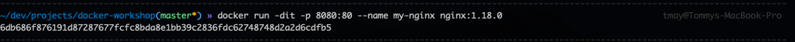
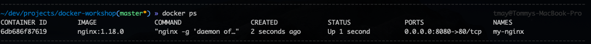
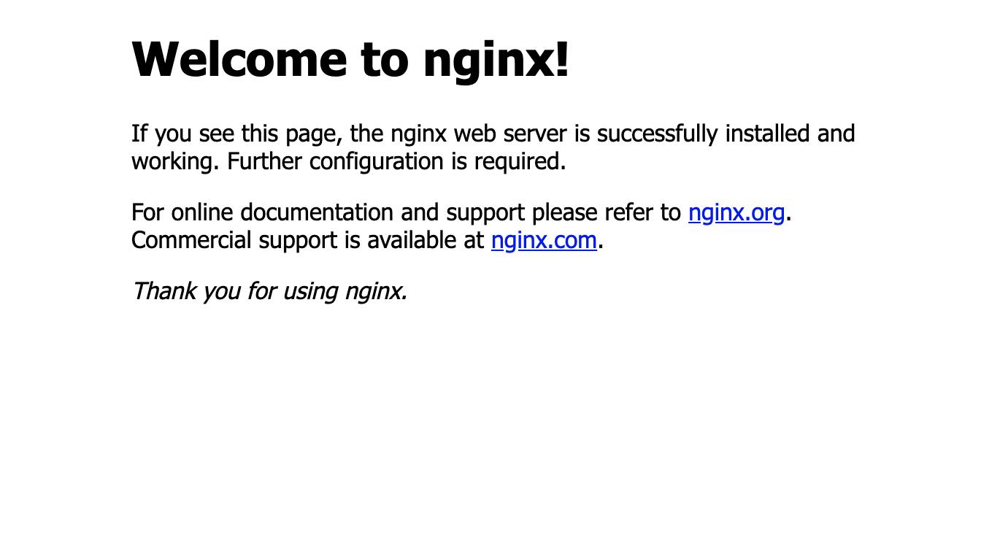
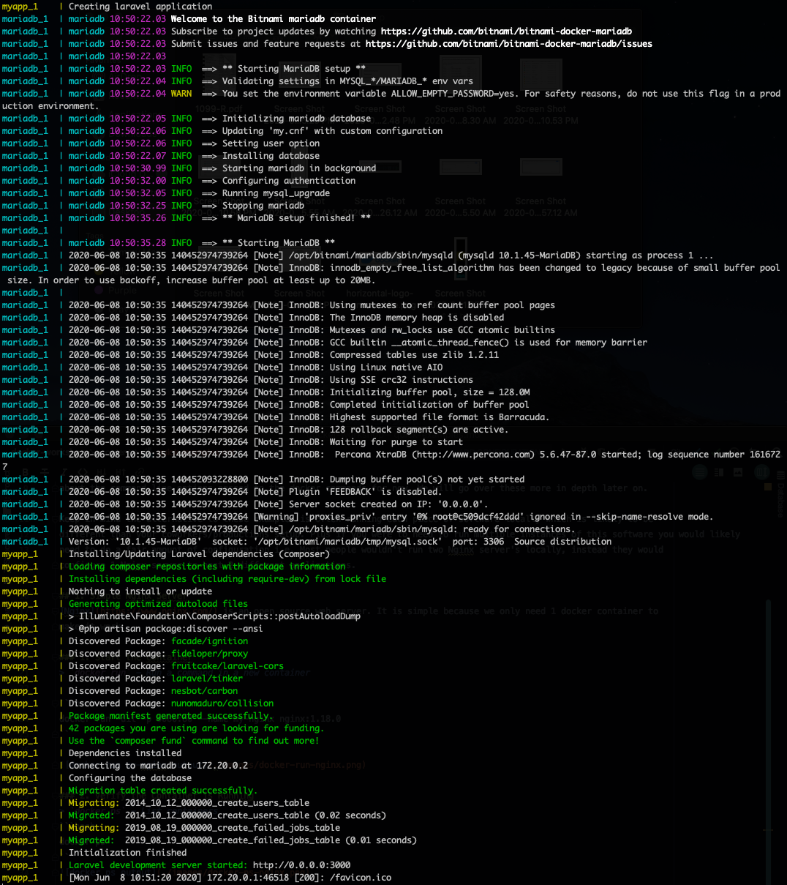
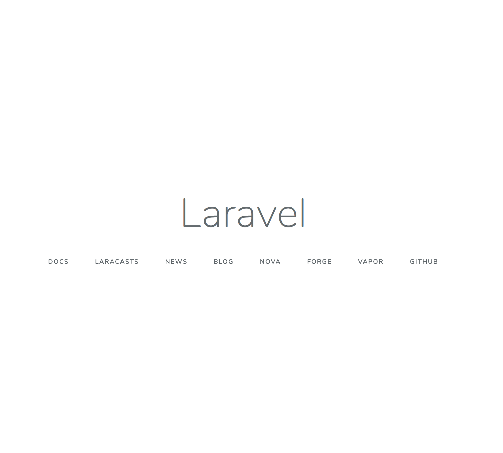

Here are some quick examples to show how easy starting applications with containers can be. You ar encouraged to run
these yourself. It is good to get into the habit of typing out these commands instead of copy/paste. Don't worry too much
about the command line options passed to the docker commands for now. We will go over these more in depth later on.

Keep in mind the alternative to these examples is often running each piece of software locally which is likely to be
different than your coworkers/productions setup. Plus if you were to need to run multiple instances of this software you would likely
need to do a fair amount of configuration i.e. Most people wouldn't run two Nginx server's locally, instead they would
configure 1 Nginx server to host 2 different applications.

## 1. Simple Nginx Server
[Nginx](https://www.nginx.com/) is an open source web server. It is simple because we only need 1 docker container to
make it work.

### 1. Start the Container
> `docker run` - Run a command in a new container

```bash
docker run -dit -p 8080:80 --name my-nginx nginx:1.18.0
```



### 2. Verify the Container is Running
> `docker ps` - List containers
```bash
docker ps
```


### 3. Verify Output in Browser
Visit [localhost:8080](http://localhost:8080) and you should see the Nginx welcome page.


## 2. PHP Laravel Framework with Database
[Laravel](https://laravel.com/) is a web application framework that needs multiple containers working together to run.

### 1. Create a Directory
```bash
mkdir ~/myapp && cd ~/myapp
```

### 2. Download a Pre-Made Docker Compose File
```bash
curl -LO https://raw.githubusercontent.com/bitnami/bitnami-docker-laravel/master/docker-compose.yml
```

### 3. Start the Docker Containers
This command will take over your terminal, so you will need to hit `Control + c` to exit on MacOS.

> `docker-compose up - Create and start containers`
```bash
docker-compose up
```


#### 4. Verify App in Browser
Visit [localhost:3000](http://localhost:3000) and you should see the Laravel homepage.


